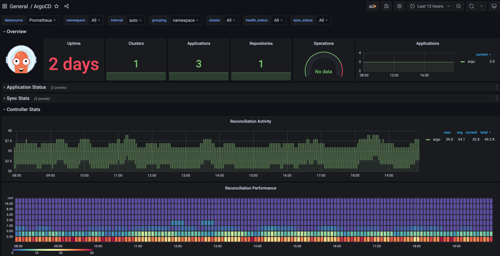

# DigitalOcean Kubernetes Challenge 2021

I chose to participate in the DigitalOcean `Kubernetes` Challenge in order to learn more about `Kubernetes` and to get a
better understanding of the challenges that are involved in deploying `Kubernetes` clusters.

## The Challenge

I picked following challenge:

> Deploy a GitOps CI/CD implementation GitOps is today the way you automate deployment pipelines within `Kubernetes` itself, and `ArgoCD`  is currently one of the leading implementations. Install it to create a CI/CD solution, using tekton and kaniko for actual image building.

## The Tools And Technologies

Following tools and technologies were used to create this challenge:

### Infrastructure

- [DOKS](https://docs.digitalocean.com/products/kubernetes/)
- [Space](https://docs.digitalocean.com/products/spaces/)
- [DigitalOcean DNS](https://docs.digitalocean.com/products/networking/dns/)

### Observability

- [kube-prometheus-stack](https://github.com/prometheus-operator/kube-prometheus)
- [Loki](https://grafana.com/oss/loki/)

### CI/CD

- [ArgoCD](https://github.com/argoproj/argo-cd)
- [Tekton](https://github.com/tektoncd)
    - Trigger
    - Pipeline
    - Dashboard

### Diverse tools

- [cert-manager](https://cert-manager.io/)
- [ingress-nginx](https://kubernetes.github.io/ingress-nginx/)
- [external-dns](https://github.com/kubernetes-sigs/external-dns)
- [oauth2-proxy](https://oauth2-proxy.github.io/oauth2-proxy/)
- [sealed-secrets](https://github.com/bitnami-labs/sealed-secrets)
- [helm](https://helm.sh/)
- [kubectl](https://kubernetes.io/docs/reference/kubectl/cheatsheet/)
- [pulumi](https://pulumi.io/)
- [auth0](https://auth0.com/)
- [task](https://taskfile.dev/)

As a `backend` for Pulumi, I chose their own [SaaS platform](https://app.pulumi.com/). And I created an account
on [auth0.com](https://auth0.com/).

## The Idea

Build the basics of CI/CD platform using `Tekton` and `ArgoCD`. I opted for a single cluster, to emulate a development
environment. To avoid any containers during development goes out of control, I took care that there is a strict
separation of the workloads with different worker node pools.

So I created three different worker node pools, one for each type of workload.


- base: This is the base node pool, with the minimum amount of resources and only for the kubernetes own workloads.
- tools: This is the node pool for the tools, which are used the whole tools like `Tekton`, Prometheus, `ArgoCD` and so on.
- workloads: This is the node pool for the workloads, which are used for the actual apps.

All is done, with setting the `taints` during the creation of the node pools.

```yaml
taints:
  - effect: NoSchedule
    key: <tools|workloads>
    value: "true"
```

## The Solution

### Infrastructure

I dived the infrastructure into three different components:

- auth: This contains the code to provision the components, which are used to authenticate and authorize the users.
- cloud: This contains the code to provision the infrastructure on DigitalOcean. Mainly the DOKS and Spaces.
- services: This contains the code to provision the services, the platform team will use for themselves and provide to
  the developers. Mainly the `Tekton` and `ArgoCD` but also the Ingress and Cert-Manager for example.

The separation of the components is done to make it easier to understand and to make it easier to change, without the
need to deploy the whole infrastructure again. `Pulumi` and other infrastructure as code tools, can take a lot of time
to finish and that is not something that I wanted.

I use `task` to create the infrastructure, which like `make` but with `yaml` files.

> **Attention:** You should have a DNS domain, you can use for the different services. I used `ediri.online` for all the services. It's already pointing to DigitalOcean DNS.

Let's see how the infrastructure is created:

#### auth0

In the folder `infrastructure/auth` I created a `Pulumi` Program, to deploy the `auth0` infrastructure. To use the `auth0`
provider you have first to create a new application of the type `machine to machine` in the UI.


It is very important, to enable all permissions for the application to access the API.


After the creation, open the "Settings" tab and copy the Domain, Client ID, and Client Secret values. We need this
values in our `pulumi` program.

You can set them via the `pulumi` config command:

```yaml
pulumi config set auth0:domain <your-domain>
pulumi config set auth0:clientId <your-clientId> --secret
pulumi config set auth0:clientSecret <your-clientSecret> --secret
```

Now you can deploy the `auth0` infrastructure via the command `task auth0-deploy`.

I also export some output values, which are used in the other components.

```go
ctx.Export("argo.clientId", argoCD.ClientId)
ctx.Export("argo.clientSecret", argoCD.ClientSecret)
ctx.Export("grafana.clientId", grafana.ClientId)
ctx.Export("grafana.clientSecret", grafana.ClientSecret)
ctx.Export("oauth2.clientId", oauth2.ClientId)
ctx.Export("oauth2.clientSecret", oauth2.ClientSecret)
```

I can refer to the values in the other components. That's very useful, because the values are not stored in the git repo
or need to be written down.

To greate groups and assign them to the users, I used the `auth0` extension called `Auth0 Authorization`.


I will not go any further on how to configure everything, as I think it will be too much for this document.

Further reading:

- https://www.pulumi.com/registry/packages/auth0/api-docs/provider/
- https://blog.dahanne.net/2020/04/15/integrating-auth0-oidc-oauth-2-with-authorization-groups-and-roles/
- https://napo.io/posts/argo-cd-with-auth0-sso-login/
- https://auth0.com/blog/use-terraform-to-manage-your-auth0-configuration/#Create-an-Auth0-client-using-HashiCorp-Terraform

#### DigitalOcean

This is pretty straight forward, as I used the DigitalOcean provider from `pulumi`. The only thing I did was to create
the API-Token and the Spaces Access ID and Secret. You can create and access them via the UI. Please refer to the
DigitalOcean documentation in case you need more information.

Again, I set them via the `pulumi` config command:

```yaml
pulumi config set digitalocean:token <your-token>  --secret
pulumi config set digitalocean:spaces_access_id <your-spaces_access_id> --secret
pulumi config set digitalocean:spaces_secret_key <your-spaces_secret_key> --secret
```

I also export some output values, which are used in the other components.

```go
ctx.Export("cluster", kubernetesCluster.Name)
ctx.Export("toolsNodePoolName", toolsNodePool.Name)
ctx.Export("kubeconfig", pulumi.ToSecret(kubernetesCluster.KubeConfigs.ToKubernetesClusterKubeConfigArrayOutput().Index(pulumi.Int(0)).RawConfig()))
ctx.Export("loki.bucket.Name", bucket.Name)
ctx.Export("loki.bucket.BucketDomainName", bucket.BucketDomainName)
ctx.Export("loki.bucket.region", bucket.Region)
```

The `kubeconfig` is very useful, because it will be used to deploy the `services` in the next step.

Again, everything is deployable via `task` and the command `task digitalocean-infra-deploy`

Further reading:

- https://www.pulumi.com/registry/packages/digitalocean/
- https://docs.digitalocean.com/products/kubernetes/
- https://www.digitalocean.com/community/tutorials/how-to-create-a-digitalocean-space-and-api-key

#### Services (Kubernetes)

This is by far the biggest part to deploy. And to be honest. I did just scratch the tip of the iceberg. There are so
many other tool to deploy, which helps tremendously during day-2 operations. Like `Kyverno` and `Falco` to name some.

I need to digitalocean token and spaces access id here again for the different services I want to deploy.

So like in the other two components, I set them via the `pulumi` config command:

```yaml
pulumi config set services:do_token <your-token>  --secret
pulumi config set services:grafana-password <your-spaces_access_id> --secret
pulumi config set services:spaces_access_id <your-spaces_secret_key> --secret
pulumi config set services:spaces_secret_key <your-spaces_secret_key> --secret
```

I deploy most of the services via helm inside the `pulumi` program using the `helm.NewRelease` function. The only big
exception is the `tekton` deployment, which is done via as `kustomize` using the `kustomize.NewDirectory` function. For
this I downloaded all `tekton` deployment manifests from the `tekton` repo and created a `kustomization.yaml` file
under `infrastructure/manifests`. Then in the function I point via the URL to the `kustomization` folder.

> Retrospectively, I would have used the `tekton` operator instead. Or try to contribute, to create a helm chart

From the code organization, I created for every service I am going to deploy an own go file and saved it
under `internal/charts`. So I have everything organized and just need to call them in the `main.go` file.

I did not use any values.yaml. Everything is inside the code, so I can benefit from the types and don't need to worry
about yaml indentation and easily insert variables and transformations.

> Retrospectively, I would maybe use golang templates instead.

To have a better idea about the possible values, I heavily used [Artifact Hub](https://artefacthub.io/) and of course the
documentations of the different services.

Further reading:

- https://www.pulumi.com/registry/packages/kubernetes/api-docs/kustomize/directory/

In the next section, I want to go into some highlights of the different components.

Again, everything is deployable via `task` and the command `task kubernetes-services-deploy` or just `task` as it is the 
default.

##### Some Highlights

###### NodeSelector and Tolerations

All the deployments are using the `nodeSelector` and `tolerations` to select the node dedicated to the `tools`

```go
"nodeSelector": pulumi.Map{
    "beta.kubernetes.io/os":           pulumi.String("linux"),
    "doks.digitalocean.com/node-pool": cloud.GetStringOutput(pulumi.String("toolsNodePoolName")),
},
"tolerations": pulumi.Array{
    pulumi.Map{
        "key":      pulumi.String("tools"),
        "operator": pulumi.String("Equal"),
        "value":    pulumi.String("true"),
        "effect":   pulumi.String("NoSchedule"),
    },
},
```

###### ArgoCD

As I am going tho use `auth0` I don't need the `dex`. So I disabled it in the `argo-cd` chart. Now It's important to set
the `config.oidc` and fill out the values from the `auth` component deployment.

Snippet:

```go
return fmt.Sprintf(`name: Auth0
issuer: https://ediri.eu.auth0.com/
clientID: %s
clientSecret: %s
requestedIDTokenClaims:
 groups:
  essential: true
requestedScopes:
- openid
- profile
- email
- 'https://example.com/claims/groups'`, clientId, clientSecret), nil
		})
```

As we set the callback to our argo-cd callback url, `https://argocd.ediri.online/auth/callback` everything works fine

###### Tekton & OAuth2-Proxy

Due to the fact that `tekton` is not offering a `helm` chart, I needed to do some custom steps. On top the Dashboard is 
not offering any authentication. So I needed to deploy the `oauth2-proxy` in front of the dashboard.

So setting the oidc config for the proxy

```go
"config": pulumi.Map{
    "clientID":     args.Auth.GetStringOutput(pulumi.String("oauth2.clientId")),
    "clientSecret": args.Auth.GetStringOutput(pulumi.String("oauth2.clientSecret")),
},
"extraArgs": pulumi.Map{
    "provider":              pulumi.String("oidc"),
    "provider-display-name": pulumi.String("auth0"),
    "redirect-url":          pulumi.String("https://auth.ediri.online/oauth2/callback"),
    "oidc-issuer-url":       pulumi.String(fmt.Sprintf("https://%s/", auth0Domain)),
    "cookie-expire":         pulumi.String("24h0m0s"),
    "whitelist-domain":      pulumi.String(".ediri.online"),
    "email-domain":          pulumi.String("*"),
    "cookie-refresh":        pulumi.String("0h60m0s"),
    "cookie-domain":         pulumi.String(".ediri.online"),
},
```
And in the Ingress of the `dashboard`, I needed to add following annotations:

```go
Annotations: pulumi.StringMap{
    "external-dns.alpha.kubernetes.io/hostname": pulumi.String("tekton.ediri.online"),
    "external-dns.alpha.kubernetes.io/ttl":      pulumi.String("60"),
    "nginx.ingress.kubernetes.io/auth-signin":   pulumi.String("https://auth.ediri.online/oauth2/sign_in?rd=https://$host$request_uri"),
    "nginx.ingress.kubernetes.io/auth-url":      pulumi.String("http://oauth2-proxy.oauth2-proxy.svc.cluster.local/oauth2/auth"),
},
```

This will, take care to redirect the user to the login page, provided by `oauth2-proxy` when the user tries to access it.

###### Observability & No Alerting

Grafana, uses oidc too for authentication and authorization. So I need to set the `oidc` config for the grafana deployment.
Similar, we do in `ArgoCD` and for the `Tekton` Dashboard. The values come again from the `auth` component via the `Pulumi`
`StackReference` function.

```go
"auth.generic_oauth": pulumi.Map{
    "enabled":               pulumi.Bool(true),
    "allow_sign_up":         pulumi.Bool(true),
    "allowed_organizations": pulumi.String(""),
    "name":                  pulumi.String("Auth0"),
    "client_id":             args.Auth.GetStringOutput(pulumi.String("grafana.clientId")),
    "client_secret":         args.Auth.GetStringOutput(pulumi.String("grafana.clientSecret")),
    "scopes":                pulumi.String("openid profile email"),
    "auth_url":              pulumi.String(fmt.Sprintf("https://%s/authorize", auth0Domain)),
    "token_url":             pulumi.String(fmt.Sprintf("https://%s/oauth/token", auth0Domain)),
    "api_url":               pulumi.String(fmt.Sprintf("https://%s/userinfo", auth0Domain)),
    "use_pkce":              pulumi.Bool(true),
    "role_attribute_path":   pulumi.String("contains(\"https://example.com/claims/groups\"[*], 'Admin') && 'Admin' || contains(\"https://example.com/claims/groups\"[*], 'Editor') && 'Editor' || 'Viewer'"),
},
```

I activated in all the deployments the `serviceMonitor` and, if available, the corresponding Grafana `dashboard`. This is
how the Service Discovery looks like in the Prometheus UI, when all services are neatly discovered.


Example config for `external-dns`:

```go
"serviceMonitor": pulumi.Map{
    "enabled": pulumi.Bool(true),
    "additionalLabels": pulumi.Map{
        "app": pulumi.String("external-dns"),
    },
},
```

This is the dashboard for the `ArgoCD`:



> Unfortunately, I could not spend time in the whole alerting part. So there is no alerting rules, beside the standard ones.

The logging is done via Loki, which uses S3 for storage and BoltDB for persistence. One major advantage of Loki is that 
it is easy to use, and it is easy to configure and uses Grafana for the UI. So I can create my dashboards and enhance them
with the LokiQL like I used to do with the PromQL.


Further reading:
- https://grafana.com/docs/loki/latest/operations/storage/boltdb-shipper/
- https://grafana.com/docs/grafana/latest/auth/generic-oauth/#set-up-oauth2-with-auth0

### CI/CD

Let us leave the infrastructure behind and go to the next section about the CI/CD pipeline. In the repository, I created
a folder called application, which contains the following folders:

- `deployments`: contains the `Kubernetes` YAML files for the deployments
- `lofi-app`: contains the app code.
- `tekton`: contains the `Tekton` YAML files for the `Tekton` pipelines

Let us go through all the components of the application.

#### Lofi-app

The app is a simple golang webapp that displays a pixel art gif. Nothing fancy and worth to mention.


#### ArgoCD

For the deployment of the lofi-app, I decided to use the App-of-Apps pattern. The sub-apps are the tekton pipeline and 
the app deployment. I use `kustomize` to glue both sub-apps together.

```yaml
apiVersion: kustomize.config.k8s.io/v1beta1
kind: Kustomization

resources:
  - tekton/lofi-tekton.yaml
  - deployment/lofi-app.yaml
```

The main `ArgoCD` Application points to this `kustomization` file.


If any changes are detected, `ArgoCD` will redeploy them accordingly.

Here is a screenshot of the lofi-app deployment


The next screenshot shows the `Tekton` pipeline.


>As you can see, I did not set ArgoCD to ignore the pipeline runs. That's the reason, the ArgoCD UI shows them the 
> state of this as `OutOfSync`. Something to work on in the future.

It is noteworthy to mention, that every secret is saved in the git as SealedSecretes. The SealedSecret controller takes
care to encrypt this and store them as secrets in the `Kubernetes` cluster.

For example the pull secret for the lofi image, as we use a private `GitHub` registry for the image.


#### Tekton

>Attention: I only use the `v1beta1` of the Tekton API. And not use the deprecated `PiplineResource`. Instead, everything
> is done via `Workspaces`

The biggest part was the `Tekton` pipelines. This was completely new for me. And I have to admit, that it took some time
until I got my head around it.

##### Trigger

As I wanted to use the webhook function from `GitHub`, I had to use the `Tekton` `EventListener`. When you create the `EventListener`
it will automatically create a service. The only thing, I needed to create was the Ingress. So I could configure the 
`GitHub` webhook to point to the service.


Security is done via the `GitHub` `X-Hub-Signature-256`, where your secret is sha256 hashed and set in the header. The
`EventListener` is automatically checks them for us, when we configure the `GitHub` interceptor.

With the `TriggerBinding` resource, we can bind the payload of the webhook to internal variables. We can use in our pipeline
In my case I extracted the git revision and git url from the payload.

```yaml 
- name: gitrevision
  value: $(body.head_commit.id)
- name: gitrepositoryurl
  value: $(body.repository.url)
```

#### Pipeline and Task

I then created some custom `Task`s and a custom `Pipeline`. I did not want to install the task form the [Tekton Hub](https://hub.tekton.dev/) 
via yaml file but rather use this cool beta feature called `Tekton Bundle`

So I can use Task from the Hub easily inside my `Tekton` pipelines:

```yaml
taskRef:
  name: golangci-lint
  bundle: gcr.io/tekton-releases/catalog/upstream/golangci-lint:0.2
```

The `kaniko` task, I wanted to write completely from scratch. So I created a custom `Task`, which uses the `kaniko` image.

#### kaniko
`kaniko` is a tool to build container images from a Dockerfile, inside a container or `Kubernetes` cluster. `kaniko` doesn't 
depend on a Docker daemon and executes each command within a Dockerfile completely in userspace. This enables building 
container images in environments that can't easily or securely run a Docker daemon, such as a standard `Kubernetes` cluster.

The heart of the `kaniko` task is following snippet, where we link all the variables and secrets.

```yaml
image: $(params.builderImage)
args:
  - --dockerfile=$(params.dockerfile)
  - --context=$(workspaces.source.path)/$(params.context)
  - --destination=$(params.image):$(params.version)
  - --oci-layout-path=$(workspaces.source.path)/$(params.context)/image-digest
  - --reproducible
```

If everything works fine, the image will be pushed to the registry.


Further reading:
- https://docs.github.com/en/developers/webhooks-and-events/webhooks/securing-your-webhooks
- https://tekton.dev/vault/triggers-v0.6.1/eventlisteners/#github-interceptors
- https://github.com/tektoncd/catalog#using-tasks-through-bundles
- https://tekton.dev/docs/pipelines/pipelines/#tekton-bundles
- https://github.com/GoogleContainerTools/kaniko

## The Conclusion

All in all, I am very happy with the result. I have a lot of fun with this hackathon challenge. I learned a lot about and
had again the opportunities to build a `Kubernetes` environment.

But there are some parts, I would change in the future:

- Separate the infrastructure from the application. 
- Probable deploy the `Kubernetes` service also via GitOps rather via `Pulumi`. So I could fan out to multiple clusters more easily.


## Missing Bits

If I had more time, I would have liked to deploy following services:

- `Falco`
- `Kyverno`
- Image Scanning (via Snyk or Aqua)